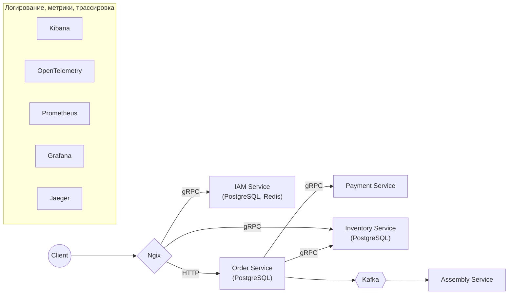

# LOMS (Logistics Order Management System)

Учебный микросервисный проект: система управления заказами и складскими остатками.
Делаю с упором на распределенные транзакции, асинхронное взаимодействие и observability.

## Стек
* **Язык:** Go (1.22+)
* **Транспорт:** gRPC (межсервисное), REST (внешнее API), Kafka (события)
* **Данные:** PostgreSQL, Redis (кэш/локи)
* **Инфраструктура:** Docker, Nginx (API Gateway)
* **Observability:** OpenTelemetry, Jaeger (трейсинг), Prometheus + Grafana (метрики)
* **Тулзы:** Taskfile, golangci-lint, Protobuf

## Структура (Monorepo)
* `order/` — оркестратор. Принимает HTTP, дергает другие сервисы по gRPC, пушит ивенты в Kafka.
* `inventory/` — склад. Резервирование товаров и работа с БД.
* `payment/` — сервис оплаты (в процессе проектирования).
* `shared/` — общие либы и контракты:
    * `proto/` — контракты (protobuf).
    * `pkg/` — общие хелперы (интерцепторы, логгеры).
    * `api/` — сгенерированный gRPC-код.

## Текущий статус (WIP)
- [x] Каркас монорепы, настройка Taskfile и линтеров.
- [x] Написаны proto-контракты.
- [ ] Имплементация бизнес-логики `order` и `inventory`.
- [ ] Прикручивание Kafka.
- [ ] Настройка `docker-compose` для поднятия всей инфры (БД, Jaeger, Grafana).

## Запуск
*(Будет добавлено после завершения настройки инфраструктуры)*